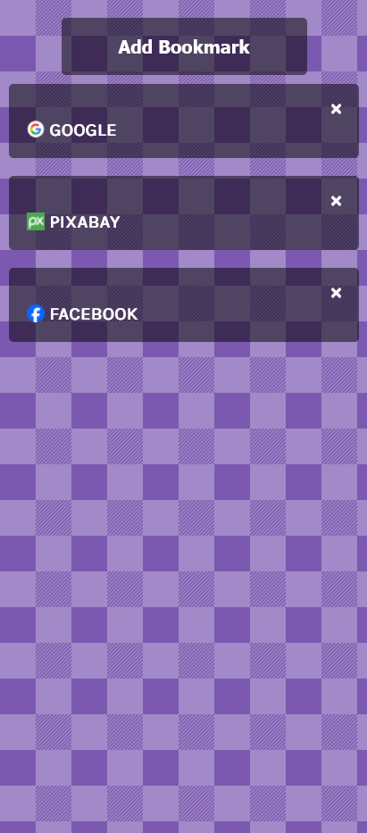
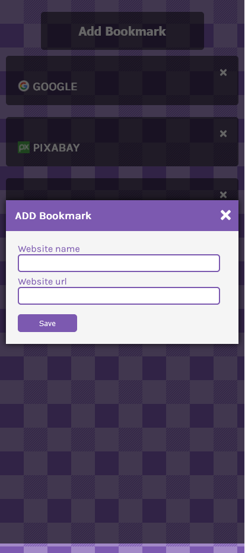
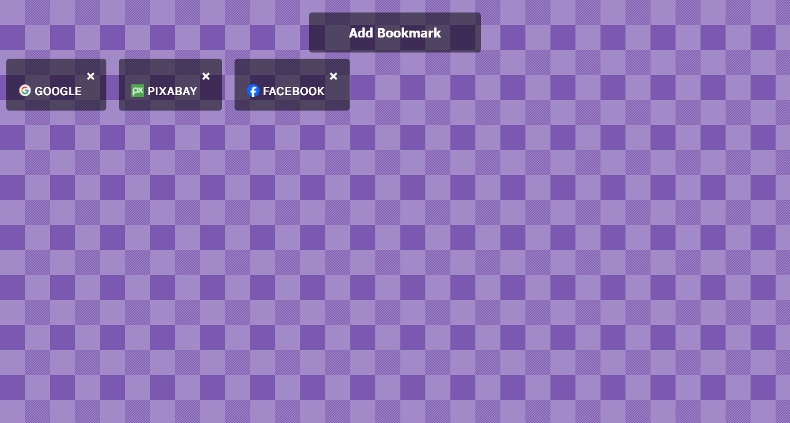
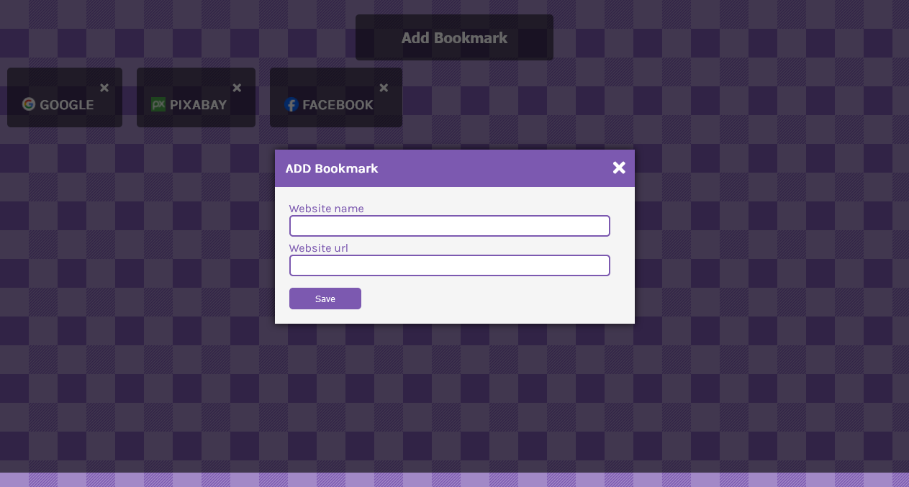

# Bookmark Manager

This is a small project to build a simple bookmark manager.

## Table of contents

- [Overview](#overview)
  - [The project](#the-project)
  - [Screenshot](#screenshot)
  - [Links](#links)
- [My process](#my-process)
  - [Built with](#built-with)
  - [Useful resources](#useful-resources)
- [Author](#author)

## Overview

### The project

Bookmark manager features:

- Add/delete bookmark
- Show/hide modal
- Show bookmarked site icon using:

```
`https:/s2.googleusercontent.com/s2/favicons?domain=${url}`
```

### Screenshot

#### Mobile Preview





#### Desktop preview





### Links

- [Github repo](https://github.com/nurmarief/bookmark-manager/)
- [Live site](https://nurmarief.github.io/bookmark-manager/)

## My process

### Built with

- Semantic HTML5 markup
- BEM architecture for CSS
- Mobile-first workflow

### Useful resources

- [fontawesome](https://www.fontawesome.com/)
- [hero patterns](https://www.heropatterns.com/)

## Author

- [nurmarief](https://github.com/nurmarief)
